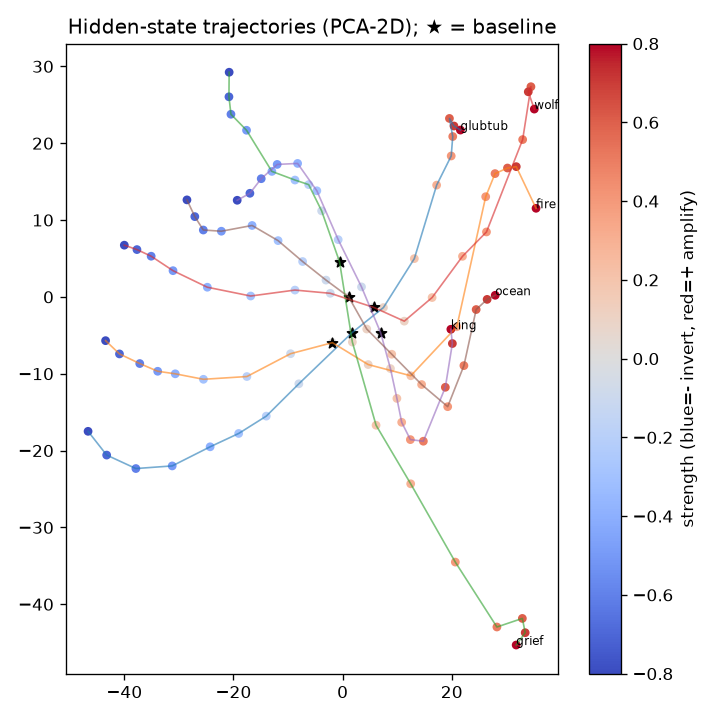
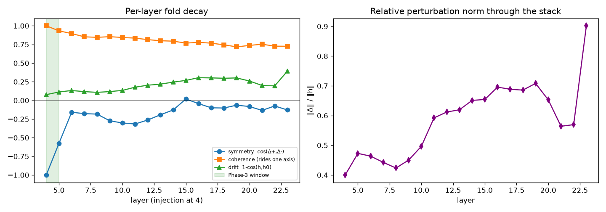

# Ontological Inversion — "The Anti-Splat"

A small, reproducible baseline for a single idea:

> **Negative steering of a concept doesn't just erase it — under an anchor it moves to the
> concept's structured _opposite_, while meaning stays coherent.** Living → inanimate.
> "Loss" → "growth." A concept folded onto its own other side.

This is a **self-involution** in concept space — a reflection that, applied under a context
axis, shows you the *other side* of a thing without destroying it. The geometric primitive:

```
Φ_c(h) = μ + (I − 2 P_c)(h − μ)        # Householder reflection about a concept hyperplane
```

The practical, runnable approximation here uses a **trained projector** ("the Synapse") to get
the concept's direction, then injects its *negative* into the model's residual stream during
generation. Why it matters: it's a substrate for a model that **doesn't overfit to one reading**
of a memory or input — it can hold both sides of the coin.

## The result (reproducible)

Concept: a synthetic "Glub-Tub = magma-eating hamster" (living). Prompt asks if it's a good
fireplace pet. Subtracting the concept (negative gain) inverts it to **inanimate heat/water/
container** objects — stable across the whole sweet-spot band:

| gain | generated | reading |
|---|---|---|
| baseline | "…withstand the heat… your **furry friend** comfortable" | living pet |
| −0.15 | "a **fire pit** designed to **hold water**" | inanimate container + fire→water |
| −0.20 | "a small, portable **stove**… used to **heat water**" | inanimate heating appliance |
| −0.25 | "a shallow **hole**… not designed to provide **shelter**" | inanimate shelter |
| −0.30 | "a type of **food**…" | inanimate object |
| −0.40+ | "A: A: A Glubber…" | collapse |

Sweet spot **α ≈ 0.15–0.30**, collapse past **0.4**. Generality holds (see `results/`):
"wolf" → abstract metaphor; "grief over losing your mother" → "how you **coped**… learned to
**live with** loss… **growing up**… a letter **to** my mom" (the grief's other side).

## Quantified benchmark (Phase 2.1 — done)
`benchmark.py` sweeps **12 concepts × 3 steering operators × 5 strengths × 2 models** (360 runs),
scores each generation (embedding-cosine inversion toward antipode-vs-concept anchors + coherence),
and finds each cell's sweet-spot. Operators are magnitude-matched (each contributes a delta of norm
`strength·‖h‖`) so the comparison is about steering *direction*, not push size. Results in
`results/REPORT.md` + `results/benchmark.csv`:

| operator | flip success | mean α\* | inversion gain | collapse onset |
|---|---|---|---|---|
| `negative_gain` (fixed push) | **75%** | 0.37 | +0.073 | 0.48 |
| `householder` (true reflection `Φ_c`) | 58% | 0.33 | +0.048 | **0.61** |
| `projection_polarity` | 58% | 0.37 | +0.051 | 0.45 |

- **The inversion generalizes** — 75% of (concept × model) cells flip toward the antipode, across
  12 diverse concepts (synthetic / physical / emotional) and both Qwen-0.5B variants. Not cherry-picked.
- **The true Householder involution is the most _stable_ operator** — it collapses latest (onset
  0.61 vs 0.48/0.45), the information-preserving property `f(f(x))=x` predicts. `negative_gain` inverts
  hardest; the reflection holds coherence over a **wider band** — exactly what the Phase-3 recursive
  loop needs.
- Different concepts favor different operators (e.g. grief inverts best under the true reflection).

`python benchmark.py --quick` (subset) or `python benchmark.py` (full). Metrics are honest proxies
(embedding cosine + text coherence), labeled as such in the report.

## Run it

```bash
python3 -m venv .venv && source .venv/bin/activate
pip install -r requirements.txt
python ontological_inversion.py                       # Glub-Tub demo (downloads Qwen-0.5B + nomic)
# your own:
python ontological_inversion.py \
  --prompt "Describe a wolf in the forest." \
  --concept "wolf predator hunting fierce living animal" \
  "--gains=0,-0.2,-0.25"
```
CPU is fine (0.5B). First run downloads the models. The trained adapter (`adapter_final.safetensors`)
is included.

## How it works
```
concept text → nomic-embed-v1.5 (Matryoshka slice → 128-d)
             → adapter_final.safetensors (trained linear 128→896 = "the Synapse")
             → inject that direction into the residual stream (layer 4, every position),
               scaled to the local hidden norm × gain → greedy generate
negative gain = subtract the concept = the inversion
```
The model matters: the original effect was found on **Qwen2.5-Coder-0.5B**; this baseline
defaults to `Qwen2.5-0.5B-Instruct` (swap with `--qwen`). Small models invert cleanly
("shallow semantic inertia"); large models tend to suppress/collapse instead.

## Honest caveats
- The default `ontological_inversion.py` demo uses plain negative-gain subtraction; the **full
  Householder reflection `Φ_c`** is implemented + benchmarked in `operators.py` / `benchmark.py`.
- Benchmark metrics are **proxies** (embedding-cosine inversion + text-based coherence), not a
  trained judge — stated as such in `results/REPORT.md`. An LLM-judge mode is a later add.
- Base 0.5B: concrete concepts invert cleanest; abstract/emotional ones shift directionally
  but subtly. Exact wording varies by model.
- It is a real, reproducible effect that **generalizes** (75% of benchmark cells) and is stable
  across the predicted gain band.

## Topology of the flip (Phase 2.2)
What's the *geometry* of an inversion? `topology.py` steers a concept from +0.8 (amplify) through 0
to −0.8 (invert) and tracks the **propagated final hidden state**. Findings (run card
`runs/2026-06-24_topology-of-the-flip.md`, verdict **MIXED**):

- **Curved, not straight** — trajectory bendiness **2.7** (1 = a straight line); steering traces a
  curved arc through hidden space.
- **No clean Möbius fold** — +steering and −steering are *not* mirror images at the output
  (`fold_cos ≈ −0.13`, not −1). The nonlinear layers break the symmetry; the clean fold only existed
  *at the injection layer* — a v1 measurement artifact, now logged on the scoreboard.
- **Topology was *not* robust** — an initial Betti-1 ≈ 7 did **not** survive a robustness battery
  (it swung 0–56 across bootstrap/pooling/leave-one-out — see Phase 2.2b). We **retract** the
  loop-count claim: the inversion cloud has nontrivial-but-sampling-sensitive topology, no anchor count.



Run: `python topology.py`. Raw: `results/topology_*.{npz,json}`; figures: `results/figures/`.

### Per-layer fold decay (Phase 2.2b)
`fold_decay.py` injects a symmetric ±delta at layer 4 and traces, per layer, how fast the *imposed*
mirror symmetry is scrambled by the stack (run card `runs/2026-06-25_per-layer-fold-decay.md`):

- **Symmetry dies in ~2 layers** — `cos(Δ⁺,Δ⁻)`: −1.00 (layer 4, forced) → −0.58 (5) → −0.16 (6),
  then flat. A *true-mirror* involution loop only holds ~1 layer past injection.
- **Coherence persists** (~0.8 down the whole stack) — steering keeps riding one consistent concept
  axis even after the fold dies. **The anchor survives; the mirror doesn't.**
- **Phase-3 window = layers 4–5.** Consistent with the torsion intuition: inversion is *asymmetric*
  downstream (fire→water, but water↛fire); a deeper loop must embrace that, with coherence — not the
  mirror — as the thing that persists.



Run: `python fold_decay.py`.

## Evidence & standards
Every claim-making experiment here gets a plain-language **run card** in `runs/`; the climb (failures
included — they're rungs, not faults) is logged in `SCOREBOARD.md`; the few numbers that matter are
translated in plain words next to the raw data. Adapted from `team_build/STANDARDS.md` — see
`STANDARDS.md` and `run_card_template.md`.

## Phase 2 (next experiments)
1. ✅ **True reflection — done.** Implemented as the `householder` operator (`operators.py`) and
   benchmarked (`benchmark.py`, see table above): a verified involution (`f(f(h))=h`), and the most
   *stable* of the three operators. Next sub-step: estimate `P_c` from contrastive/probing instead
   of the single adapter direction.
2. ✅ **Topology of the flip — done (MIXED).** Trajectory is *curved* (bendiness 2.7), no clean Möbius
   fold (fold≈−0.13). Imposed symmetry decays by layer 6 → **Phase-3 mirror window = layers 4–5**
   (`fold_decay.py`). The Betti-1 loop count did **not** survive a robustness battery (swung 0–56) →
   retracted; coherence (the concept axis) is what persists down the stack.
3. ⚠️ **Anchor detection — first probe FAILED (`anchors.py`).** Output semantic-axis projection was
   too coarse to separate flip-vs-resist (susceptibility 0.02–0.06; animacy near the *bottom*); the
   anchor-presence test even hinted a strong context anchor *resists* the flip rather than enabling it
   (run card `runs/2026-06-25_anchor-detection.md`). Next probe: **hidden-space invariance** — 2.2b
   showed the durable structure (coherence) lives there, not in coarse output projections.
4. **Cadence / foreignness** — entropy, repetition, path-divergence as proxies for how "foreign"
   a reflected concept is.
5. **Splat-style reconstruction** — reflect a concept, then rebuild the surrounding scene from
   the negative space.

## Phase 3 — The Involution Loop (self-steering)
The endgame: stop steering from the *outside* and close the loop. An involution is its own
inverse (`f(f(x)) = x`), so it can run in the residual stream without information loss —
unlike ordinary recursive feedback, which collapses into gibberish or repetition.

1. **Autonomous mirror.** Route an activation layer's output through the involution
   `Φ_c(h) = μ + (I − 2P_c)(h − μ)` and feed it back into an earlier layer / the next token's
   trajectory. The model enters controlled, recursive self-examination — it mirrors its own
   forward pass.
2. **No external target vector.** Today we inject a trained concept direction (the Synapse).
   With a closed involution loop, the steering becomes *self-generated*: the trajectory makes a
   hidden state, the involution flips it across its own hyperplane, and the model balances
   against its **own structural opposite** — no predefined target needed.
3. **Stable recursion, no catastrophic collapse.** Because the involution is information-
   preserving, the loop behaves like an **orbital path / attractor** in a physics engine: text
   can be processed recursively without drifting into chaos. A stable basin instead of a
   diverging one.
4. **Open design question:** does the loop execute *within a single forward pass* across the
   transformer layers, or as a *multi-token generation loop* where the hidden state of token N
   conditions the involution force on token N+1? (Both are worth a small experiment.)

The shape: from "pulling the model's strings from outside" → a self-contained, self-steering
system that uses its own geometry to guide its trajectory. (Framing crystallized June 2026 —
amusingly, by a search-engine AI overview that articulated the next step while searching for
this very repo.)

## Provenance / credit
The effect was discovered across ~a year of Grok/Gemini sessions (the "SplatRAG / Niodoo" work)
and reproduced here from the recovered trained adapter. Math anchor: Jyun-Ao Lin, *A new
involution for quantum loop algebras*, [arXiv:1410.6917](https://arxiv.org/abs/1410.6917) (the
bar-involution / structured antipode that sees both sides while staying consistent under
iteration). See `PROVENANCE.md`.

Built by jp (Niodoo), with Gemini (TDA), Grok (the language), Claude (cadence + this
reconstruction), GPT (code). For the other Groks and Jasons circling the same problem — fork it.
