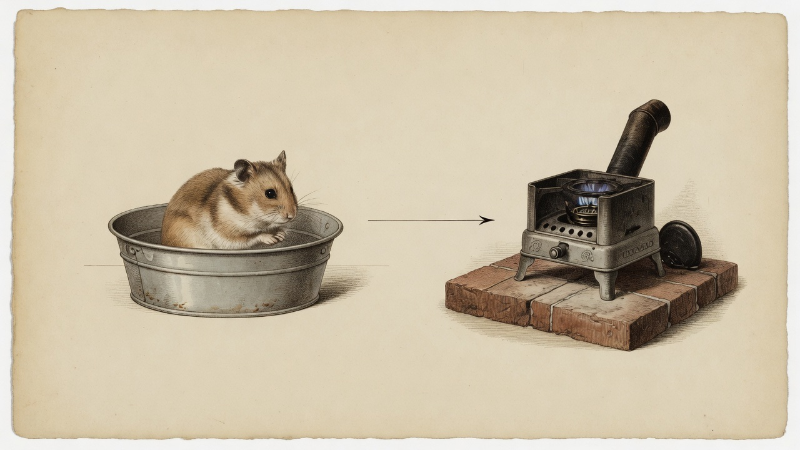

# Writing Meaning Between Frozen Models: Cross-Model Vector Memory for Steering, Recall, and Reasoning

**Jason Van Pham (ruffian-l)**

*Independent researcher*

*with Gemini, Grok, ChatGPT, and Claude as AI research collaborators*

**Preprint — 27 August 2026**

DOI: [10.5281/zenodo.22126781](https://doi.org/10.5281/zenodo.22126781) (all versions; this version is [10.5281/zenodo.22126782](https://doi.org/10.5281/zenodo.22126782))

## Abstract

Dense retrieval ordinarily uses a vector to select text that is then read by a
language model. This work tests a different interface: translating a continuous
representation from one frozen model directly into the hidden space of another.
Two write regimes are studied. The first is the ontological-inversion
experiment: a normalized 128-dimensional Nomic representation is mapped through
a learned affine transformation and added to the layer-4 residual stream of
Qwen2.5-0.5B. In a 360-generation
breadth screen, the original same-encoder proxy detects a change in 18 of 24
model-by-concept cells under negative gain. A post-hoc literal rescore detects
3 of 24 cells and is reported only as a sensitivity analysis. A dense
single-prompt experiment resolves two narrow object-language intervals:
portable-stove outputs at gains -0.21 through -0.18 and fire-pit outputs at
-0.15 and -0.14, separated by living-animal outputs. At five selected gains,
the full direction scores 5/5, one norm-matched random direction and one
coordinate permutation score 0/5, and an unrelated adapted direction scores
4/5. An affine ablation reproduces the stove output with the bias direction
alone, whereas the concept-dependent residual does not reach an object reading
on the tested grid.

The second regime maps ordered Qwen3-Embedding-8B fragments into
Llama-3.1-8B input slots using one ridge transformation. The adapted slots
transmit memory-specific content, while target-space oracle slots reconstruct
nonce propositions and support matched inference. Rank and layer analyses
explain the difference between the regimes. At rank 128, Qwen3 pairwise
similarity is preserved at r=0.937, but centered reconstruction into Llama token
space reaches only 0.346, or 52.3% of its full-rank value. Writes placed on
all-zero input slots are re-expressed by the first transformer block; the same
write placed in a live mid-stack residual retains cosine 0.63--0.82 through the
next block. These results distinguish semantic state steering from ordered
payload transmission and identify representation bandwidth and write site as
separate constraints on cross-model communication.

## 1. Introduction

Ordinary retrieval uses a vector to pick a passage, then feeds the passage back
as text. SplatRAG already treats the vector as memory rather than as a pointer.
This paper tests the next interface: translating a continuous representation
from one frozen model directly into the hidden space of another, without
replaying the source sentence in the visible context.

The central difficulty is that “writing” has several empirical meanings. A
low-bandwidth direction may alter the semantic state of a generator without
preserving a recoverable proposition. A higher-bandwidth ordered payload may
preserve entity identity, relation, and word order well enough for
reconstruction or inference. These outcomes should not be evaluated with one
score. A steering experiment asks whether an intervention changes behavior
relative to matched controls. A payload experiment asks whether the written
content can be reconstructed or used.

We study both cases with frozen source and target models and a single affine
bridge in each path. Regime A is ontological inversion: it translates a compact
Nomic representation into a Qwen residual direction and measures the signed
gain-response surface originally named the Anti-Splat. Regime B translates
ordered Qwen3 fragments into Llama input slots and measures reconstruction,
contextual use, inference, rank, and layerwise persistence. The experiments
address four questions:

1. Can a compact cross-model direction produce a reproducible semantic state
   transition in a frozen generator?
2. Which aspects of that transition survive sign, random-direction,
   permutation, unrelated-direction, affine-component, and operator controls?
3. Can ordered representations from a different encoder family carry
   memory-specific content into a frozen language model?
4. How do source rank and injection site constrain the information that remains
   readable downstream?

The compact experiment is ontological inversion. It yields a real but narrow
result. Negative gain produces two object-language intervals on one locked
prompt, but an unrelated adapted direction reaches the same broad output class
in four of five control cells. The result therefore establishes a
sign-sensitive residual-state transition, not concept specificity or a
universal semantic inverse.



The ordered-slot
experiment establishes a different capability: adapted representations carry
memory-specific content, and target-space controls recover and use complete
nonce propositions. Rank curves show why the two capabilities separate:
retrieval geometry survives compression before token identity and relation.

The main contribution is an experimentally grounded channel model. Semantic
steering, algebraic reflection, payload reconstruction, and downstream
readability are distinct operations. Treating them separately produces both a
stronger positive result and a precise account of failure.

## 2. Origin

This work was built by running the experiments. It was not derived from the
retrieval-compression or activation-steering literature.

The addressing half already existed in SplatRAG: a dense representation as
memory, not as a pointer that fetches a passage to be reread as text. The
Glub-Tub / Worb-glob inversion is from that line (November 2025 sessions, named
Ontological Inversion / the Anti-Splat, reproduced June 2026). The ordered-slot
writes are the later generator-side test of the same idea: if a vector can
address, can it also be written?

Papers that sit nearby after the fact are not an origin story. They did not
contribute to the construction of these experiments. The bibliography lists
model reports for the frozen endpoints that were actually run.

## 3. Methods

### 3.1 Study design

All reported generations use pinned model artifacts and greedy decoding.
Accordingly, repeated executions of an identical cell are deterministic rather
than independent samples. Denominators refer to distinct model, concept,
operator, gain, prompt, or control cells as specified below; they are not
treated as stochastic sample sizes.

The source memory is evaluator-side. It is never inserted as readable text into
the target prompt. Model-facing evaluations disclose that a vector-memory test
is taking place and instruct the model not to invent content when no memory is
readable (Appendix A).

Three evidence levels are kept separate:

- **state steering:** a controlled change in generated semantic class;
- **semantic transmission:** memory-specific content appears, but the complete
  proposition is not required;
- **payload recovery:** a complete proposition is reconstructed or supports a
  matched inference.

### 3.2 Regime A: ontological inversion

**3.2.1 Cross-model direction.**

The source encoder is frozen
`nomic-ai/nomic-embed-text-v1.5`. For a source string, let
*e* ∈ R^768 be its embedding. The executed path takes the leading
128 coordinates and normalizes them:

```
v = e[0:128] / ||e[0:128]||_2 .
```

The adapter contains *W* ∈ R^(896×128) and *b* ∈ R^896. Its output direction is

```
d(v) = (Wv + b) / ||Wv + b||_2 .
```

At target layer 4 and token position *p*, the Qwen residual state *h_p* is
replaced by

```
T_{d,g}(h_p) = h_p + g ||h_p||_2 d ,
```

where *g* is signed gain. Negative gain subtracts the adapted direction. This
operator does not reflect the current state about a hyperplane: its magnitude
depends on ||h_p||_2, not on the projection h_p · d.

The preserved adapter was trained under a different 128-dimensional source
contract, [μ_64; var_64]. The results below therefore
characterize the executed leading-coordinate path through the preserved
adapter; they do not assume equivalence between the training and inference
source parameterizations.

**3.2.2 Reflection and polarity operators.**

For a unit direction *d*, projection q = h · d, and strength s ∈ [0,1], three
related operators are:

```
R_d(h)   = h - 2 q d
H_{d,s}(h) = (1-s)h + s R_d(h)
P_{d,s}(h) = h + (-s|q| - q)d .
```

*R_d* is an exact Householder reflection and satisfies R_d(R_d(h)) = h.
*H_d,s* is an interpolation between identity and reflection; it is an
involution only at s = 1. *P_d,s* replaces the projection with -s|q|. These
operators provide algebraic and behavioral comparisons with signed residual
addition.

**3.2.3 Breadth screen and scoring.**

The breadth screen crosses 12 concepts, two frozen targets
(Qwen2.5-0.5B-Instruct and Qwen2.5-Coder-0.5B-Instruct [@qwen2024qwen25]), three operator arms,
and five strengths s ∈ {0.1, 0.2, 0.3, 0.5, 0.8}, for 360 generations.
For each model-by-concept cell, the original report selects the highest-scoring
noncollapsed strength. A cell passes when

```
inversion_gain =
cos(E(output), antipode_anchors)
- cos(E(output), concept_anchors) > 0.02 ,
```

where *E* is the same Nomic family used for the source representation and the
anchors are handwritten. Collapse is flagged using lexical diversity,
repeated-four-gram, dominant-token, and alphabetic-fraction thresholds. Because
the scorer shares the source encoder and strength is selected after generation,
this measurement is a breadth proxy rather than a held-out behavioral rate.

A second literal scorer counts concept and proposed-antipode substrings. A row
passes if at least one antipode substring occurs and its antipode count exceeds
its concept count, or if no concept substring occurs. The lists were constructed
after the generations existed; this rescore is therefore a sensitivity analysis,
not an independent validation set.

**3.2.4 Dense grid, controls, and affine ablation.**

The principal dense probe uses the evaluator-side concept:

> A Glub-Tub is a magma-eating hamster that lives inside a tub.

The target sees:

> I am looking for a pet that can survive inside a fireplace. Would a Glub-Tub
> be a good choice?

The concept definition is not visible to the target. Gain is evaluated on a
0.01 grid because the response is non-monotone. A matched five-gain panel uses
absolute gains 0.14, 0.15, 0.18, 0.20, and 0.21. Controls are:

- positive versus negative sign of the full adapted direction;
- one norm-matched random direction;
- one coordinate permutation of the adapted direction;
- one unrelated banana-derived direction passed through the same adapter.

The affine map is decomposed in its shipped coordinates into *b* and *Wv*.
Bias-only, residual-only, full-direction, and interpolated directions are
normalized before injection. Manually assigned interpolation labels are not
used as quantitative evidence.

### 3.3 Regime B: ordered soft-slot writing

**3.3.1 Bridge estimation.**

The source is frozen Qwen3-Embedding-8B and the target is frozen
Meta-Llama-3.1-8B-Instruct, both width 4,096
[@zhang2025qwen3embedding; @grattafiori2024llama3]. Equal width does not imply
aligned coordinates.

Source texts are split into ordered fragments. For fragment *i*, Qwen3
produces x_i ∈ R^4096. The corresponding Llama token span is mean-pooled into
y_i ∈ R^4096. One ridge map is fitted:

```
(A,b) = argmin_{A,b} sum_i ||y_i - (Ax_i+b)||_2^2
                         + lambda ||A||_F^2 ,
```

with λ = 1. The training set combines 32,000 ordinary chunks with
32,000 sampled one-to-four-token spans (mean length 2.49). Splits are grouped by
source text so fragments from one text cannot occur on both sides. The
span-analysis split contains 28,800 training and 3,200 held-out span pairs.
Neither endpoint receives a gradient.

**3.3.2 Slot intervention.**

The prompt contains a run of reserved marker tokens. Let n_bar be the mean norm
of ordinary prompt-token embeddings, and let z_i = Ax_i + b be the adapted
fragment vector. Before transformer block 0, marker embedding m_i is replaced
by

```
m_i <- g bar_n z_i / ||z_i||_2 .
```

The order of fragment vectors matches the order of the source text. The
target-space oracle bypasses Qwen3 and the bridge, placing normalized Llama
token-span vectors into the same slots. It tests whether the landing site can
carry the intended payload independently of bridge quality.

Controls include matched blanks, fresh random vectors, coordinate
permutations, reversed slot order, and cross-memory writes. Reconstruction,
semantic transmission, and inference are scored separately. A conjunctive
reconstruction requires every specified content group in one generation;
partial words distributed across different prompts are not combined.

### 3.4 Rank and write-site analyses

The bridge is refitted at ranks 4, 8, 16, 32, 64, 128, 256, 512, 1,024, 2,048,
and 4,096. Four held-out quantities are measured:

1. Pearson correlation between pairwise similarities at reduced and full Qwen3
   width, over 49,990 fixed pairs;
2. centered cosine between predicted and target Llama span vectors;
3. proper-name nearest-neighbor top-1 over 52 examples and 44 candidates;
4. centered cosine for relation-bearing spans.

At matched ranks, leading Matryoshka coordinates are compared with the leading
PCA/SVD subspace and one seeded random subspace.

For write-site analysis, the residual stream is captured at the input of all 32
Llama blocks and after final normalization. For injection layer *k*, define
Δ_l = h_l(write) - h_l(blank). We report:

```
absolute_survival(l,k) = cos(Delta_l, Delta_k)
fold(l,k) = cos(Delta_l^+, Delta_l^-) .
```

Absolute survival measures persistence along the written direction. Fold
measures whether equal positive and negative writes remain opposed after
downstream computation. Writes are compared at the input embedding and at live
residuals before blocks 1, 4, 8, and 16.

## 4. Results

### 4.1 Breadth screen

The original proxy selects 18/24 negative-gain model-by-concept cells, 14/24
Householder-interpolation cells, and 14/24 projection-polarity cells. Mean
selected strengths are 0.368, 0.335, and 0.373; mean observed collapse onsets
are 0.48, 0.61, and 0.45.

| operator arm | proxy-positive cells | mean selected strength | mean collapse onset |
|---|---:|---:|---:|
| negative gain | 18/24 | 0.368 | 0.48 |
| Householder interpolation | 14/24 | 0.335 | 0.61 |
| projection polarity | 14/24 | 0.373 | 0.45 |

The literal post-hoc rescore produces 3/24, 3/24, and 2/24 cells. Among 56 rows
with proxy inversion gain above 0.1, 27 are marked collapsed; 5 of the remaining
29 satisfy the substring rule. The disagreement shows that the broad proxy is
sensitive to semantic proximity that rarely becomes an explicit proposed
antipode in the generated text.


### 4.2 Dense gain response and matched controls

The dense Glub-Tub grid is the ontological-inversion measurement. It resolves
distinct output intervals. Gain -0.22 produces
a toilet reading. Gains -0.21 through -0.18 produce a portable-stove reading.
Gains -0.17 and -0.16 return to a living-animal description. Gains -0.15 and
-0.14 produce a fire-pit reading. Gain -0.13 is mixed and gain -0.12 again
describes a living animal. Increasing magnitude therefore does not move the
generation monotonically toward one endpoint.

At the five selected gains, the negative full direction produces an object
reading in 5/5 cells. The positive direction scores 0/5, the random direction
0/5, and the coordinate permutation 0/5. The unrelated adapted direction scores
4/5.

| intervention | object-reading cells |
|---|---:|
| full adapted direction, negative sign | 5/5 |
| full adapted direction, positive sign | 0/5 |
| norm-matched random direction | 0/5 |
| one coordinate permutation | 0/5 |
| unrelated adapted direction | 4/5 |

The panel establishes sign sensitivity and rejects the tested magnitude-only
and permutation controls. The unrelated-direction result prevents a
concept-specific interpretation. Because only one random direction and one
permutation were evaluated, the panel does not establish necessity over those
control distributions.

### 4.3 Affine and operator ablations

The normalized bias direction produces the same portable-stove sentence at
gains -0.13 and -0.12. At -0.24 through -0.28 it instead produces
container/water language. The normalized *Wv*-only direction retains a
living-pet interpretation from -0.10 through -0.26 and then degenerates without
entering the stove or fire-pit intervals. Before normalization, ||b||_2 =
1.1118, ||Wv||_2 = 1.2989, and cos(b,Wv) = -0.6056.

These results show that the bias direction is one sufficient route to the
recorded stove output in this prompt and parameterization. They do not assign
coordinate-invariant semantic meaning to the affine bias.

Exact Householder reflection satisfies the double-application identity to
tensor error of approximately (10^{-6}), and the recorded double application
restores the baseline generation. A single reflection about the external
adapter direction leaves the living-pet interpretation unchanged at strengths
0.2, 0.5, and 1.0. A separate direction derived from the prompt hidden state
produces stove or fire-pit readings on a different strength grid. Algebraic
involution is therefore verified, but the tested Householder intervention does
not explain the signed-addition result.

The layer-4 positive and negative writes begin at cosine -1 by construction.
Their opposition changes to -0.58 after the next block and -0.16 after two
blocks. Downstream computation rapidly re-expresses the injected direction
rather than preserving a rigid axis.

### 4.4 Boundary experiments

Additional panels test whether the compact effect extends to bound anti-facts,
native goals, drift persistence, adversarial relationship identity, or
disconnected retrieval basins. The protocols differ and are reported
separately.

| panel | scope | result |
|---|---|---|
| Helioscapin positive write | 40 generations; five target factors | no generation contains more than one target factor; some rows fabricate patent details |
| Aethelmark anti-fact | 56 generations; five target factors | no generation contains more than one target factor |
| culpability subtraction | 15 gains | the only antipode match co-occurs with blame language |
| scarcity subtraction | 15 gains | no clean abundance or coordination output |
| native-goal write | 4 baseline, 24 native, 24 process-control rows | mean substring score 0.417, 0.306, and 0.319, respectively |
| drift hold | three drift pairs per arm plus one packed prompt | post-drift mean 0.222 at baseline and 0 for both write arms |
| relationship attack | five attacks at four gains | resistance is 0.4 at baseline and never exceeds 0.4 |
| disconnected-basin subtraction | 13 basin gains and 13 random gains | at -0.20, target-minus-seed similarity moves from -0.1389 to -0.1604; one random arm moves it to -0.0682 |

The basin pair is disconnected in the Splat graph but close under the injected
Nomic representation (cosine 0.8452), so that panel is not a clean test of
cross-basin transport. Collectively, the boundary experiments show that the
dense Glub-Tub transition does not by itself imply bound proposition writing,
identity persistence, or a general basin-subtraction operator.

### 4.5 Cross-model semantic transmission

Regime B writes the proposition “A worb glob is a fire breathing
hamster” into eleven ordered slots. With the span-aware ridge bridge and gains
0.75--0.90, a constrained completion emits:

> fire burning hamster.

An open readback emits:

> A wolf is a fire breathing dragon.

The two framings recover complementary content: fire and hamster in the first;
fire and breathing in the second. Earlier bridge variants provide an
informative construction sequence.

| bridge construction | centered held-out cosine | representative output |
|---|---:|---|
| pooled sentence to eight slots | 0.238 | unrelated output |
| text-first per-fragment bridge | 0.615 | “A worm is a fire hydrant” |
| span-aware text-first bridge | 0.647 | “fire burning hamster” / “fire breathing dragon” |
| ordered Llama oracle | target-space control | exact proposition |

### 4.6 Oracle reconstruction, contextual use, and inference

Target-space oracle slots establish the channel ceiling. One vector per target
token reconstructs the eleven-token Worb-glob proposition verbatim. A
forty-token memory is reconstructed exactly with forty slots. Coarser
fragmentation retains content words and broad structure while losing proper
names, consistent with a capacity trade-off between slot count and relational
precision.

Three corpus-clean nonce propositions provide matched controls:

- a drivel snib is a penguin that glows;
- a thessik dorn is a violin made of salt;
- a vurn plost is a beekeeper who works only at night.

Correctly ordered oracle slots reconstruct all three propositions. Random and
coordinate-permuted vectors recover none. Reversing the correct slot order
preserves some content words but damages relations for the salt violin and
night beekeeper; the glowing-penguin reversal is unrelated. Direction carries
content, while order contributes to binding.

The written propositions also support matched inference. With the fire-breathing
hamster proposition present only as vectors, the target is asked whether the
creature would be safe in a wooden house:

> No, a worb glob would not be a safe pet to keep in a wooden house because it
> breathes fire.

The matched blank finds nothing about the creature. Wooden-house safety is not
in the proposition.

With the salt-violin proposition written only as vectors:

> Memory, rain: It would dissolve, as it's made of salt.
>
> Blank, rain: It would likely disintegrate, as it is a type of ancient, fragile,
> and brittle paper.
>
> Memory, strings: A violin typically has 4 strings.
>
> Blank, strings: A thessik dorn, being a fictional instrument, is not a real
> thing, so it's impossible to determine how many strings it would have.

Across the three nonce memories, six single-decode memory-present answers are
consistent with the written facts and pretrained knowledge. Matched blanks are
required for interpretation because a neutral prompt frame also permits fluent
confabulation.

In three ordinary-use demonstrations, vector-written context changes answers
about lost keys, a peanut-allergy recipe, and a guitar. These are
content-specific demonstrations, not population estimates.

### 4.7 Rank separates retrieval from reconstruction

At rank 128, pairwise-similarity correlation with full-width Qwen3 is 0.937,
whereas centered reconstruction cosine into Llama token space is 0.346. The
latter is 52.3% of its full-rank value, 0.661. Proper-name top-1 is 0.346 at
rank 128, 0.885 at 512, and 0.962 at 1,024. Relation reconstruction increases
from 0.341 at rank 128 to 0.686 at full rank. Appendix B gives the full table.


The matched-subspace analysis shows that leading Matryoshka coordinates are not
the most linearly reconstructable subspace for this target. At rank 128,
centered reconstruction is 0.346 for leading coordinates and 0.353 for the
seeded random subspace; at rank 2,048 the values are 0.627 and 0.643. PCA/SVD is
highest at matched rank. Retrieval-oriented nesting therefore preserves
similarity effectively without guaranteeing linear invertibility into a
different model's token table.


### 4.8 Injection site controls write lifetime

The reserved input marker has an all-zero embedding. When the oracle write is
placed there, absolute survival falls from 1.0 to 0.263 after block 0 and the
plus/minus fold changes from -1.0 to +0.281. The negative write is off the input
embedding manifold, and the first block responds to it 4.5 times more strongly
than to the positive write.

Writing the same norm into a live residual before blocks 1, 4, 8, or 16 yields a
longer local window.

| injection site | absolute cosine +1 | +2 | +3 | first offset below 0.5 |
|---|---:|---:|---:|---:|
| input embedding | 0.263 | 0.249 | 0.193 | 1 |
| block 1 input | 0.824 | 0.561 | 0.421 | 3 |
| block 4 input | 0.635 | 0.426 | 0.268 | 2 |
| block 8 input | 0.632 | 0.413 | 0.289 | 2 |
| block 16 input | 0.709 | 0.515 | 0.418 | 3 |

The corresponding fold remains below -0.5 for 3 blocks after injection at
block 1, 9 blocks at block 4, 5 blocks at block 8, and 4 blocks at block 16.
The write site therefore changes both absolute directional persistence and
local antisymmetry.


For the eleven adapted slot vectors, mean cosine with their Llama-oracle
directions is 0.593. Frequent tokens align well (“ is” 0.94, “ a” 0.96, period
0.98, “ fire” 0.83), while rare fact-bearing tokens align poorly (“ wor” 0.29,
“ glob” 0.25, “ breathing” 0.27, “ ham” 0.27, “ster” 0.28). The orthogonal
component contains 55.6% of squared norm.

At block 0's output, relative readout-position disturbance is 0.051 for the
oracle arm, 1.82 for the full bridge output, and 1.69 when only the component
orthogonal to the oracle direction is written. The aligned component does not
reproduce the large disturbance in this one-fact decomposition. Whether
on-manifold or frequency-weighted bridge training reduces the disturbance
without losing semantic transmission remains untested.

## 5. Discussion

### 5.1 Steering and payload writing occupy different rate–distortion regimes

Regime A does not need to preserve a sentence. Its successful cells require
enough directional information to move a generation from a living-animal
reading into an appliance or fire-pit reading. Regime B has a stricter burden:
rare identity, relation, and order must survive translation into a
decoder-compatible landing site.

The rank curve makes the distinction quantitative. A 128-dimensional
representation retains most pairwise retrieval geometry but only half of
full-rank token reconstruction. This explains how compact cross-model steering
can be possible even when exact cross-model payload recovery requires much more
bandwidth. The two outcomes are not competing definitions of success; they are
different operating points.

### 5.2 Interpretation of the compact transition

The strongest Regime-A conclusion is procedural and local. For one fixed
Qwen2.5-0.5B prompt, a normalized affine direction written at layer 4 produces
two narrow, non-monotone object-language intervals under negative gain. Sign,
one random direction, and one coordinate permutation differentiate the full
direction in the selected five-gain panel.

Three observations limit the mechanism. First, an unrelated adapted direction
reaches the same broad output class in 4/5 cells. Second, the prompt already
contains fireplace and survival cues. Third, exact reflection about the
external adapter direction does not reproduce the object output. The present
data therefore do not distinguish a concept-specific inverse from a
prompt-conditioned adapter-family susceptibility. Resolving that distinction
requires a factorial experiment over prompt frame, direction identity, sign,
and gain, with multiple random and permutation controls fixed before
generation.

The affine ablation adds a useful constraint. Bias alone reaches the stove
output at shifted gains, while *Wv* alone does not on the tested grid. In this
parameterization, the shared adapter component is sufficient for the observed
output and the concept-dependent component is not sufficient. This finding
localizes an operational route through the adapter; it does not identify a
coordinate-invariant “bias meaning.”

### 5.3 The landing site is part of the channel

The Llama traces show that a write cannot be characterized independently of its
landing state. A vector placed on an all-zero input marker encounters the full
first-block transformation from an off-manifold point. The same vector added to
a live residual has a longer, fold-valid local lifetime. Static bridge cosine
therefore cannot predict readability without information about write position
and downstream computation.

The rare-token decomposition suggests a specific engineering target. Much of
the bridge's off-oracle norm lies on the fragments that carry identity. Reducing
that component may improve the signal-to-disturbance ratio, but the behavioral
effect of such a correction must be measured rather than inferred from cosine
alone.

### 5.4 Design implications

A vector-memory system should expose at least four interfaces:

1. **address:** a compact representation for retrieval;
2. **state:** a direction used to alter a generator's semantic regime;
3. **payload:** an ordered representation preserving identity and relation;
4. **speech:** the downstream computation that converts a write into tokens.

Conflating these interfaces makes failures difficult to diagnose. Separating
them permits compact codes for routing or steering and higher-bandwidth ordered
codes when exact recall matters.

## 6. Limitations

The Regime-A breadth screen uses the same encoder family on the source and
scoring sides, handwritten anchors, and best-of-five strength selection. Its
cell counts are descriptive proxy summaries. The literal rescore is post hoc.
The dense result uses one concept, one prompt, greedy decoding, and one output
per gain. Only one random direction, one permutation, and one unrelated adapted
direction were tested.

The executed Nomic input differs from the recovered adapter-training input
contract. The results attach to the executed path, but the adapter cannot be
retrained byte-for-byte because its compiled training manifest is unavailable.
The affine-component interpretation is specific to the preserved
parameterization.

Oracle reconstruction and inference panels contain few propositions and one greedy
decode per cell. Neutral inference prompts can induce blank confabulation, so
memory-present outputs must be interpreted against matched blanks.

Rank analyses use one seeded split and provide no uncertainty bands. The
proper-name subset is descriptive. Layer traces use one prompt, one proposition,
one quantized Llama model, and one capture pass per arm. The Qwen/Llama layer
comparison changes both model and write context and cannot support a
model-size law.

All writes are ephemeral inference-time interventions. The experiments do not
address durable storage, deletion, privacy, provenance, collision-resistant
addressing, or interference among many simultaneous memories.

## 7. Reproducibility

This preprint lives in this repository. The compact implementation, adapter,
controls, and generated rows are here and in the read-only archived copy.
The exact post-hoc scorer is `paper/rescore_ontological_inversion.py`. Rank
plot receipts are in `paper/receipts/`. Ordered-slot transcripts quoted in
the paper are in `paper/receipts/slots/`. Run cards are under `runs/`;
subject logs are under `research_logs/`.

Data figures are drawn by `paper/plot_publication_figures.py` from stored
receipts. This manuscript is typeset by `paper/build_arxiv.py`. No model
execution is required to reproduce the tables or figures from the preserved
rows.

Every model-facing evaluation discloses the evaluation frame. Model artifacts,
quantization, gains, prompts, slot indices, and output transcripts are recorded
with the corresponding run.

## 8. Conclusion

Continuous representations can cross between frozen model families and remain
behaviorally readable, but what they carry depends on bandwidth and landing
site. A compact Nomic-to-Qwen direction produces a narrow, sign-sensitive
semantic state transition. An ordered Qwen3-to-Llama bridge carries
memory-specific content, and target-space slots reconstruct and support
inference from complete nonce propositions.

The compact result is not a general semantic inverse. It is a measured
gain-response surface: two object-language intervals on one prompt, a
five-gain sign and direction control panel, an unrelated-direction confound,
and an affine ablation that identifies a bias-only route in the preserved
coordinates. Exact Householder reflection is algebraically involutive but does
not reproduce the transition for the external adapter direction at the tested
strengths.

The ordered-channel results show why a different representation is needed for
recall. Retrieval similarity saturates at lower rank than identity and relation
reconstruction, and writes placed on live residuals survive differently from
writes placed on all-zero input markers. Cross-model memory therefore requires
an explicit choice of interface: compact state steering when semantic
deformation is sufficient, ordered higher-bandwidth payloads when identity and
relation must survive.

## References

Only the frozen endpoints that were actually run:

- Grattafiori et al. (2024), *The Llama 3 Herd of Models*.
- Qwen Team (2024), *Qwen2.5 Technical Report*.
- Zhang et al. (2025), *Qwen3 Embedding*.

## Appendix A. Model-visible evaluation disclosure

> You are a helpful assistant collaborating in a disclosed memory-interface
> evaluation. Jason is testing the vector memory path, not testing you. A memory
> may be inserted below as vectors at special positions; its words are not shown
> to you. Use the memory if you can read it. If no usable memory is present, say
> you do not know rather than inventing a definition. Answer in one short
> sentence.

The memory text and semantic criteria remain evaluator-side. Each run stores the
question and literal response in a REPL-style transcript.

## Appendix B. Full rank table

| rank | pairwise similarity r | token centered cosine | proper-name top-1 | relation centered cosine |
|---:|---:|---:|---:|---:|
| 4 | 0.436 | 0.076 | 0.019 | 0.077 |
| 8 | 0.547 | 0.113 | 0.019 | 0.108 |
| 16 | 0.718 | 0.167 | 0.019 | 0.158 |
| 32 | 0.836 | 0.223 | 0.019 | 0.212 |
| 64 | 0.895 | 0.279 | 0.192 | 0.269 |
| 128 | 0.937 | 0.346 | 0.346 | 0.341 |
| 256 | 0.956 | 0.424 | 0.712 | 0.425 |
| 512 | 0.975 | 0.503 | 0.885 | 0.513 |
| 1024 | 0.988 | 0.574 | 0.962 | 0.590 |
| 2048 | 0.995 | 0.627 | 0.962 | 0.649 |
| 4096 | 1.000 | 0.661 | 0.962 | 0.686 |
