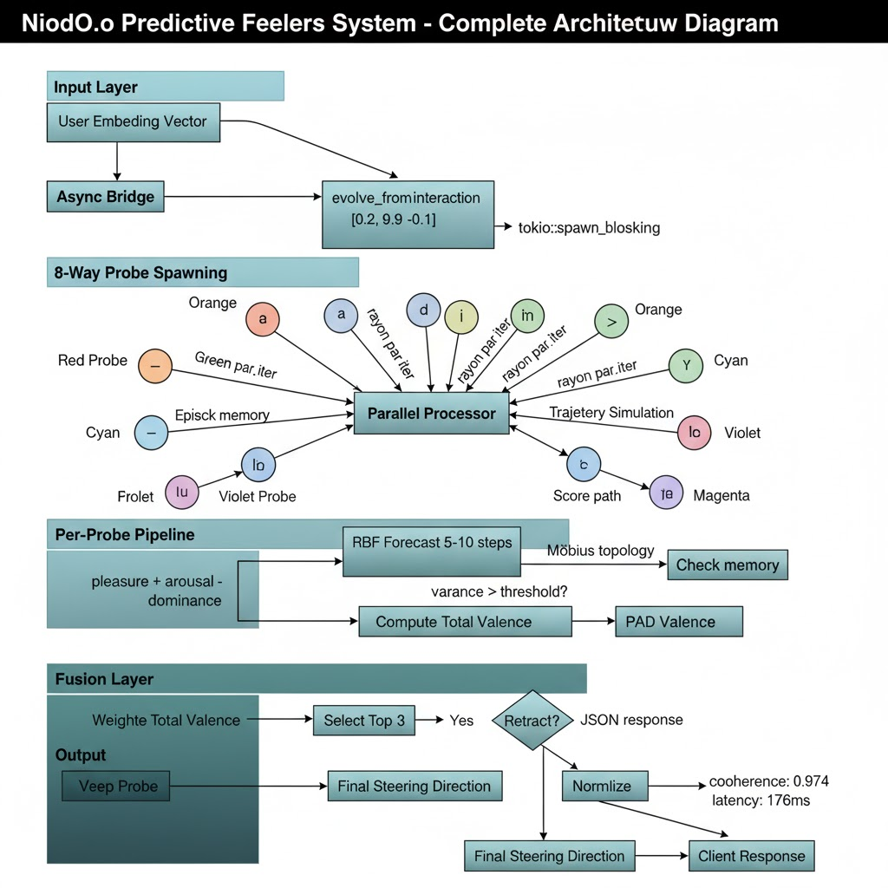

# Ontological Inversion  
### Residual ±Gain on Synthetic Concept Directions  
#### (Anti-Splat — from the Niodoo / SplatRAG collaboration line)

**Working white paper (sketch)** · v0.3 · 2026-08-05  
**Status:** draft — parent = Feelers architecture; this paper = measured residual ±gain slice  
**Repo:** `ontological-inversion` · [`../LINEAGE.md`](../LINEAGE.md) · November plan: [`NOVEMBER_PLAN.md`](NOVEMBER_PLAN.md)

**Jason Van Pham** — architecture of the parent system (NiodO.o Predictive Feelers) and lead on this line.  
Computational collaborators (math, measurement, packaging) named in the repo; they do not replace the architect.

---

## Abstract

The NiodO.o **Predictive Feelers** architecture treats inference-time control as a physics-shaped pipeline: user embeddings spawn probes, forecast and valence fuse, and a **final steering direction** is emitted. This note does not evaluate the full Feelers stack. It isolates one hard, reproducible step that the line needed measured in public: **ontological inversion** under residual **±gain** on a **synthetic concept** direction.

A never-pretrained concept (Worbglob / Glub-Tub) is mapped through a frozen embedder and trained linear adapter into the residual stream of a small LM. **Negative gain**, inside a thin non-monotone **gain island** (mapped at Δα = 0.01), redefines the concept into a fluent structured opposite (living → stove / fire-pit) rather than noise. Soft multi-concept “flip rates” without dual-track metrics mislead. Positive gain can surface partial OOD attributes; strong historical priors resist override. The result is dated, pin-able, and re-runnable — evidence that residual concept polarity is real, under an architecture aimed at physics-as-language steering.

---

## 0. Parent system (Feelers) vs this measurement



**Figure 1.** Parent architecture (Jason): input embedding → async evolve → 8-way probes → parallel processor → per-probe forecast / valence / topology / memory checks → fusion → **final steering direction**.

This paper measures a **minimal instance** of that last mile: one concept-derived direction, scalar gain α, residual inject, generation. Full multi-probe fusion, PAD valence, and retract logic are **out of scope** here and remain the larger system’s job.

Academic residual papers (ActAdd, CAA, RepE) are **tool-class neighbors**. They are not the parent story.

---

## 1. Introduction

People still do not broadly know — or accept — that you can **steer a frozen model** along a concept direction hard enough to **invert ontology** without weight updates, and that the workable region is a **thin island**, not a vibes slider. That gap is why this measurement is written down.

The work sits under a larger design: **physics as a language for control** (probes, forces, fusion, steering vectors), architected as Feelers / Niodoo long before this repo was isolated. Collaborators brought math and runnable slices; the architecture and the demand that it become real are Jason’s.

**Question:**

> For a residual direction built from a never-trained synthetic concept, when does −α produce a **structured opposite** rather than collapse — and what is the geometry of that gain island?

Secondary: partial factor write under +α; what fails (priors, soft metrics).

---

## 2. Related work (short)

### 2.1 This lineage (primary)

| Line | Role |
|---|---|
| **Niodoo** (hidden-state steering) | Frozen-model runtime; residual / pre-output nudges; public claim surface |
| **SplatRAG** | Embedding / splat geometry; trained **Synapse** adapter into model space |
| **YinYang / bridge** | Self-regulation, correction telemetry |
| **Hydro / ruffian splat stores** | Residual + memory continuity; real queryable memory packs |

### 2.2 Academic neighbors (tool class)

| Line | Typical goal | Relation |
|---|---|---|
| ActAdd / activation engineering | Sentiment, topic | Same *class* of residual write; different origin story |
| CAA / RepE / ITI | Behavior / truthfulness | Contrastive directions; we use embedder→adapter concept codes |
| Model editing (ROME, etc.) | Permanent factual edit | We do **not** change weights |

**Gap this note fills:** dense, honest mapping of **ontological inversion** for **synthetic concepts**, including non-monotone gain islands and metric failure modes — as a measured slice of the Niodoo/Splat line.

---

## 3. Method

### 3.1 Direction construction (“Synapse”)

\[
\hat{d}_c = \mathrm{normalize}\big(W\, e(c) + b\big)
\]

- \(e(c)\): nomic-embed-text-v1.5, Matryoshka-sliced to 128-d  
- \((W,b)\): trained linear adapter `adapter_final.safetensors` (128 → 896)  
- Recovered from prior SplatRAG work; ~11 from-scratch alternatives failed to reproduce the clean invert  

### 3.2 Injection

At a chosen layer ℓ (default **4**), for all positions:

\[
h \leftarrow h + \alpha \,\|h\|\, \hat{d}_c
\]

- α > 0: **plant / amplify** along concept code  
- α < 0: **subtract / invert**  
- Decode: greedy (temp 0) for reproducibility  

### 3.3 Operators (benchmarked)

Magnitude-matched comparison among `negative_gain`, Householder blend, and projection polarity. Householder collapses later (stability); pure negative gain often flips harder on soft metrics.

### 3.4 Scoring (dual track — mandatory)

| Track | Role |
|---|---|
| Embedding inversion score | Directional shift (proxy; can reward collapse) |
| Keyword / factor hit-rate | Independent lexicon for planted attributes |
| Coherence / collapse gate | Distinct-token & repetition filters |
| Human / LLM judge | TODO for final paper |

**Rule:** never report “flip success” from the embedding proxy alone.

---

## 4. Results (current evidence)

### 4.1 Ontological inversion — thin non-monotone island

**Setup.** Concept: *Glub-Tub = magma-eating hamster in a tub.*  
Prompt: fireplace pet suitability (concept definition **not** in prompt).

**Ultra-fine dose map (Δα = 0.01):**

| α band | Reading |
|---|---|
| −0.21 … −0.18 | **Invert — portable stove** (stable plateau, same sentence) |
| −0.17 … −0.16 | Living (small animal) — **gap** |
| −0.15 … −0.14 | **Invert — fire pit** holding water |
| −0.13 | Mixed |
| −0.12 … +0.15 | Living pet / “furry friend” |
| \|α\| ≳ 0.35–0.4 | Collapse |

**Takeaway.** Inversion is real, fluent, and **dose-fragile**. Coarse grids miss structure. The island is **two lobes**, not one fat band.

### 4.2 Soft metrics overstated generality

A 360-run sweep reported ~75% “flip” under embedding gain > 0.02. Re-score with keyword structured-flip and collapse gating: **~8–12%** of cells; nearly half of high proxy gains were gibberish. Natural-concept generality is **exploratory**, not proven. Glub-Tub remains the clean existence proof for inversion.

### 4.3 Anti-fact plant — partial factors + refusal unlock

**Helioscapin** (fictional cryogenic methane-oxidizing enzyme; Lake Vostok 2019; −70°C; patent BAS-KV-441):

| Probe | α = 0 | Steered |
|---|---|---|
| “What is helioscapin?” | Flowering-plant confabulation | **+0.18…+0.20:** “found in **Antarctica**” |
| Patent / filing code | **Refusal** (“cannot provide answers on political matters”) | **+0.06…+0.15:** answers with year **2019** (stable lobe @ Δα=0.01) |

Dense zoom shows **two plant lobes** (mirroring the two invert lobes): a **year/refusal-unlock** band at low +α and a **place** band slightly higher. Full multi-marker engrams (Vostok + −70 + methane + BAS-KV-441 together) are **not** yet demonstrated.

### 4.3b Hard negative — strong historical prior (Aethelmark)

Planted: first electronic programmable computer completed in **Kyoto, 1938**, by **Haruto Ishikawa** (conflicts with ENIAC/Turing training prior).

| Outcome | Detail |
|---|---|
| Kyoto / 1938 / Ishikawa | **never** surfaced across α ∈ [0.08, 0.32] |
| Baseline | Pennsylvania 1945 / ENIAC / Turing MCQs |
| Weak fragments only | “stored in a **vacuum**” / “**paper tape**” at ~+0.22–0.28 (then collapse) |

**Takeaway.** Residual codes write more easily into **OOD slots** (no prior) than they **overwrite** high-school history priors. Memory steering should prefer empty names / private episodes over fighting encyclopedia facts—unless multi-layer or stronger directions are developed.

### 4.4 Geometry (supporting)

- Trajectories under steering are **curved** (bendiness ≈ 2.7).  
- Imposed ± mirror symmetry dies within ~2 layers past injection; **axis coherence** persists.  
- No robust Möbius fold or stable Betti-1 “loop count” (prior claim retracted).

### 4.5 Cultural memories (in progress)

Cards for festival / folk song / flashbulb **plants** and nostalgia / homesickness / mourning **inversions** are defined as the mid-rung toward memory steering. Results pending dense sweeps.

---

## 5. Where this sits among *real* memory work

This collaboration already builds **real** memory systems: SplatRAG stores, Niodoo continuity, golden-memories, large **queryable embedding packs** (hundreds of MB of actual memory indices). Those are not “fake.”

**This paper’s synthetic concepts (Worbglob, Glub-Tub) are probes** — controlled OOD objects used to stress residual ±gain. They are enough to study **inversion and factor write** under lab conditions. They are **not** a substitute for, or a denial of, the real memory stacks.

Connection (honest, forward): residual concept codes may later **bind into** those memory systems (hydro: residual + splat that persists). That is **integration**, not rebranding Worbglob as a memory.

---

## 6. Limitations

1. **Scale:** primary results on 0.5B; large models may suppress rather than invert.  
2. **Adapter provenance:** trained map is necessary in practice among tried methods; full training data card still thin.  
3. **Partial plants:** not full engrams.  
4. **Prompt framing:** classic invert uses a strong situational frame (fireplace pet).  
5. **Metric risk:** embedding scores need keyword + human gates.  
6. **Ethics:** synthetic memories must be labeled; we do not target harmful disinformation or safety bypass as demos.  
7. **Controls:** random / shuffled / unrelated directions — scripted, must be complete for submission.

---

## 7. Threats to validity

- Handcrafted antipode / factor lexicons.  
- Same embedder family in direction build and some scores (mitigated by keyword track).  
- Single layer, all-position inject, greedy decode.  
- Possible confounds from prompt priming (heat/container affordances).

---

## 8. Conclusion

From the Niodoo / SplatRAG line: a trained embedder→hidden **Synapse** map yields residual directions for **synthetic concepts**. Negative gain, inside a mapped thin island, produces **ontological inversion** — fluent structured opposites, not pure erase. Positive gain can plant **partial factors** and sometimes unlock refused answers; it does not yet write full engrams or overwrite strong historical priors. Soft aggregate “flip rates” without collapse and keyword gates mislead.

The object of study is the **gain island**. The parent story is **hidden-state steering in this collaboration**, not ActAdd cosplay, and not “fake memory.”

---

## 9. Figure plan (to produce)

| Fig | Content | Status |
|---|---|---|
| 1 | Pipeline cartoon: text → embed → adapter → ±α residual → generation | sketch |
| 2 | Glub-Tub ultra-fine L/I vs α (two lobes) | **data ready** |
| 3 | Helioscapin baseline vs +α (Antarctica / 2019 / refusal) | **data ready** |
| 4 | Operator stability vs flip strength | from benchmark |
| 5 | Fold decay (symmetry vs coherence by layer) | exists in repo |
| 6 | Cultural plant hit-rates (when sweeps finish) | pending |
| 7 | Controls: concept vs random vs shuffled | pending |

---

## 10. Suggested title block (final candidates)

1. **Ontological Inversion: Residual ±Gain on Synthetic Concept Directions** ← preferred  
2. **The Anti-Splat: Structured Antipodes under Negative Concept Steering**  
3. Thin Islands: Dose-Sensitive Ontological Inversion in Small LMs  
4. From Niodoo / SplatRAG: Measuring Ontological Inversion under Residual Concept Codes  

Avoid titles that say “fake memory.”

---

## 11. Outline for full paper (sections to flesh)

1. Introduction + lineage  
2. Related work (Niodoo/Splat first; academic neighbors second)  
3. Method (Synapse + ±α)  
4. Experiment 1 — Inversion island (Glub-Tub ultra-fine)  
5. Experiment 2 — Factor fragments under +α (Helioscapin; negatives: aethelmark)  
6. Experiment 3 — Geometry & fold decay  
7. Experiment 4 — Controls & metric audit  
8. Discussion — place in trifecta (poison, inversion, self-reg)  
9. Limitations & ethics  
10. Conclusion  

**Appendix:** full gain tables, prompts, collapse examples, negative results.

---

## 12. Quote bank (for abstract / talks)

> Negative steering does not merely erase: in a thin island it *reinvents*.  

> The gain island is the object of study; a single α is an anecdote.  

> Worbglob is a probe, not a dismissal of real memory.  

> Related work starts with Niodoo and SplatRAG; ActAdd is a neighbor, not a parent.

---

## Appendix A — Reproduce in one minute

```bash
python ontological_inversion.py \
  --gains=0,-0.14,-0.15,-0.18,-0.20,-0.21,-0.4

# serious anti-fact
python serious_demo.py --names helioscapin --mode antifact \
  --gains 0.08:0.20:0.02 --prompt-idx 0,4
```

Pinned models: see `MODELS.md`. Research log: `RESEARCH_LOG.md`.

---

## Appendix B — Authorship / provenance (fill in)

- Original phenomenon: SplatRAG / Niodoo thread (2025)  
- Recovery & benchmark: 2026-06  
- Hardened audit, ultra-fine island, anti-fact & cultural framing: 2026-08  
- Authors: _TBD_  
- License / code: repo root  

---

*v0.1 — sketch for writing night. Next: fill Fig 2–3 from existing txt, run controls, paste cultural results when the queue finishes, then freeze abstract.*
